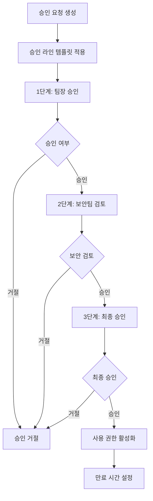

# 📋 승인관리 시스템 (Approval Management System)

## 🎯 개요

LINA Data Portal의 승인관리 시스템은 데이터 접근, 대시보드 배포, 리포트 발행 등 다양한 리소스에 대한 체계적인 승인 워크플로우를 제공합니다.

## 🏗️ 시스템 아키텍처

### 핵심 컴포넌트

```
┌─────────────────┐    ┌─────────────────┐    ┌─────────────────┐
│   Approval      │    │ ApprovalStep    │    │ApprovalLineTemp │
│   (승인 요청)    │────│  (승인 단계)     │────│   (승인 라인)    │
└─────────────────┘    └─────────────────┘    └─────────────────┘
         │                       │                       │
         │                       │                       │
┌─────────────────┐    ┌─────────────────┐    ┌─────────────────┐
│      User       │    │  TargetObject   │    │ SecurityPolicy  │
│   (사용자)       │    │  (승인 대상)     │    │   (보안 정책)    │
└─────────────────┘    └─────────────────┘    └─────────────────┘
```

## 📊 데이터 모델

### 1. Approval (승인 요청)

```java
@Entity
public class Approval {
    // 기본 정보
    private Long id;
    private ApprovalType type;          // DASHBOARD_DEPLOY, DATA_ACCESS, REPORT_PUBLISH
    private String title;
    private String description;
    private ApprovalStatus status;      // PENDING, APPROVED, REJECTED
    private Priority priority;          // URGENT, HIGH, MEDIUM, LOW
    
    // 요청자/검토자 정보 (정규화)
    private Long requesterId;
    private String requesterEmail;      // 보조 정보
    private String requesterName;       // 보조 정보
    private Long reviewerId;
    private String reviewerEmail;       // 보조 정보
    private String reviewerName;        // 보조 정보
    
    // 승인 대상 오브젝트 (1급 개념)
    private TargetType targetType;      // DATASET, DASHBOARD, REPORT, CLUSTER 등
    private String targetId;
    private String targetName;
    private AccessScope accessScope;    // READ, WRITE, DEPLOY, SHARE 등
    private SensitivityLevel sensitivityLevel; // NORMAL, SENSITIVE, PII, CONFIDENTIAL
    
    // 사용 기간 관리
    private Integer usageDurationDays = 90;  // 기본 3개월
    private LocalDateTime usageExpiresAt;
    
    // 보안 정책
    private Boolean requiresMasking = false;
    private Boolean requiresAuditLog = false;
    private Long maskingPolicyId;
    private Long policySetId;
    
    // 업무 정당성
    private String businessJustification;
    private String dataUsagePurpose;
    private LocalDateTime expectedCompletionDate;
}
```

### 2. ApprovalStep (승인 단계)

```java
@Entity
public class ApprovalStep {
    private Long id;
    private Long approvalId;            // 승인 요청 ID
    private Integer stepOrder;          // 단계 순서 (1, 2, 3...)
    private String stepName;            // 단계명 ("팀장 승인", "보안팀 검토")
    private Long approverId;            // 승인자 ID
    private String approverEmail;       // 승인자 이메일
    private String approverName;        // 승인자 이름
    private String approverRole;        // 승인자 역할
    private String approverDepartment;  // 승인자 부서
    private ApprovalStepStatus status;  // PENDING, APPROVED, REJECTED, SKIPPED
    private Boolean isRequired = true;  // 필수 단계 여부
    private Boolean isParallel = false; // 병렬 처리 여부
    private LocalDateTime approvedAt;
    private String approvalComment;
}
```

### 3. ApprovalLineTemplate (승인 라인 템플릿)

```java
@Entity
public class ApprovalLineTemplate {
    private Long id;
    private String templateName;        // "데이터 접근 승인", "대시보드 배포 승인"
    private ApprovalType applicableType; // 적용 가능한 승인 타입
    private String description;
    private Boolean isActive = true;
    private Integer totalSteps;         // 총 단계 수
    
    // 템플릿 조건
    private SensitivityLevel minSensitivityLevel; // 최소 민감도 레벨
    private AccessScope applicableScope;          // 적용 가능한 접근 범위
    private String targetTypePattern;             // 대상 타입 패턴
}
```

## 🔄 승인 워크플로우

### 1. 승인 요청 생성

```java
// 1. 승인 요청 생성
Approval approval = new Approval(
    ApprovalType.DATA_ACCESS,
    "고객 데이터 분석 권한 요청",
    "마케팅 캠페인 효과 분석을 위한 고객 데이터 접근",
    requester,
    TargetType.DATASET,
    "customer_dataset_001",
    "고객 행동 데이터셋",
    AccessScope.READ,
    SensitivityLevel.PII
);

// 2. 자동 정책 적용
approval.applySecurityPolicies();

// 3. 승인 라인 생성
approvalLineTemplateService.createApprovalSteps(approval);
```

### 2. 승인 단계 처리



### 3. 사용 기간 관리

```java
// 민감도별 차등 사용 기간
if (accessScope.isTemporary()) {
    approval.setUsageDurationDays(1);      // 임시 권한: 1일
} else if (sensitivityLevel.isHighSensitive()) {
    approval.setUsageDurationDays(30);     // 민감정보: 1개월
} else {
    approval.setUsageDurationDays(90);     // 일반: 3개월 (기본값)
}

// 승인 완료 시 사용 권한 활성화
approval.activateUsage();
```

## 🎯 승인 대상 오브젝트 (Target Objects)

### 지원하는 대상 타입

| TargetType | 설명 | 예시 |
|------------|------|------|
| `DATASET` | 데이터셋 | 고객 데이터, 매출 데이터 |
| `DASHBOARD` | 대시보드 | 실시간 모니터링 대시보드 |
| `REPORT` | 리포트 | 월간 성과 리포트 |
| `NOTEBOOK` | 노트북 | Jupyter 노트북 |
| `CLUSTER` | 클러스터 | Databricks 클러스터 |
| `MODEL` | ML 모델 | 고객 이탈 예측 모델 |
| `API` | API 엔드포인트 | 외부 API 연동 |
| `FILE` | 파일 | 데이터 파일, 문서 |

### 접근 범위 (Access Scope)

| AccessScope | 설명 | 권한 레벨 |
|-------------|------|-----------|
| `READ` | 읽기 전용 | 낮음 |
| `WRITE` | 읽기/쓰기 | 중간 |
| `DELETE` | 삭제 권한 | 높음 |
| `DEPLOY` | 배포 권한 | 높음 |
| `SHARE` | 공유 권한 | 중간 |
| `EXPORT` | 내보내기 | 중간 |
| `ADMIN` | 관리자 권한 | 최고 |
| `MASKED_READ` | 마스킹된 읽기 | 낮음 |
| `TEMPORARY_READ` | 임시 읽기 | 낮음 |

### 민감도 레벨 (Sensitivity Level)

| SensitivityLevel | 설명 | 기본 사용기간 | 추가 승인 |
|------------------|------|---------------|-----------|
| `PUBLIC` | 공개 정보 | 90일 | 불필요 |
| `INTERNAL` | 내부 정보 | 90일 | 불필요 |
| `NORMAL` | 일반 정보 | 90일 | 불필요 |
| `SENSITIVE` | 민감 정보 | 30일 | 필요 |
| `CONFIDENTIAL` | 기밀 정보 | 30일 | 필요 |
| `PII` | 개인정보 | 30일 | 필요 |
| `PHI` | 의료정보 | 30일 | 필요 |
| `FINANCIAL` | 금융정보 | 30일 | 필요 |

## 🔐 보안 정책 연동

### 1. 자동 보안 정책 적용

```java
public void applySecurityPolicies(Approval approval) {
    // 민감도 레벨에 따른 기본 정책
    if (approval.getSensitivityLevel().isHighSensitive()) {
        approval.setRequiresMasking(true);
        approval.setRequiresAuditLog(true);
        approval.setUsageDurationDays(30); // 1개월로 제한
    }
    
    // 고위험 접근 범위의 경우 추가 제한
    if (approval.getAccessScope().isHighRisk()) {
        approval.setRequiresAuditLog(true);
        approval.setUsageDurationDays(7); // 1주일로 제한
    }
}
```

### 2. 마스킹 정책 연동

```java
@Entity
public class MaskingPolicy {
    private Long id;
    private String policyName;
    private String targetColumn;
    private MaskingType maskingType;    // FULL, PARTIAL, HASH, ENCRYPT
    private String maskingPattern;      // "***-**-1234"
    private Boolean isActive = true;
}
```

## 📊 API 엔드포인트

### 승인 요청 관리

```http
# 승인 요청 생성
POST /api/approvals
Content-Type: application/json

{
  "type": "DATA_ACCESS",
  "title": "고객 데이터 분석 권한",
  "description": "마케팅 캠페인 분석용",
  "targetType": "DATASET",
  "targetId": "customer_dataset_001",
  "targetName": "고객 행동 데이터셋",
  "accessScope": "READ",
  "sensitivityLevel": "PII",
  "businessJustification": "고객 세그먼트 분석 및 타겟 마케팅 전략 수립",
  "dataUsagePurpose": "개인정보는 마스킹 처리하여 통계 분석 목적으로만 사용",
  "expectedCompletionDate": "2024-03-15T00:00:00"
}
```

```http
# 승인 요청 목록 조회
GET /api/approvals?status=PENDING&type=DATA_ACCESS&page=0&size=20

# 승인 요청 상세 조회
GET /api/approvals/{id}

# 내가 요청한 승인 목록
GET /api/approvals/submitted

# 내가 처리해야 할 승인 목록
GET /api/approvals/pending
```

### 승인 처리

```http
# 승인 처리
PUT /api/approvals/{id}/approve
Content-Type: application/json

{
  "comment": "업무 목적이 명확하고 보안 정책을 준수하여 승인합니다.",
  "conditions": ["마스킹 처리 필수", "30일 후 자동 만료"]
}

# 거절 처리
PUT /api/approvals/{id}/reject
Content-Type: application/json

{
  "comment": "업무 정당성이 불충분합니다. 추가 설명이 필요합니다.",
  "reason": "INSUFFICIENT_JUSTIFICATION"
}
```

### 사용 권한 관리

```http
# 만료 예정 권한 조회 (30일 이내)
GET /api/approvals/expiring?days=30

# 사용 권한 활성화
POST /api/approvals/{id}/activate-usage

# 만료된 권한 정리
POST /api/approvals/cleanup-expired-usage
```

## 🔄 승인 라인 템플릿 시스템

### 1. 템플릿 정의

```json
{
  "templateName": "개인정보 데이터 접근 승인",
  "applicableType": "DATA_ACCESS",
  "minSensitivityLevel": "PII",
  "steps": [
    {
      "stepOrder": 1,
      "stepName": "팀장 승인",
      "approverRole": "TEAM_LEADER",
      "isRequired": true,
      "isParallel": false
    },
    {
      "stepOrder": 2,
      "stepName": "개인정보보호 담당자 검토",
      "approverRole": "PRIVACY_OFFICER",
      "isRequired": true,
      "isParallel": false
    },
    {
      "stepOrder": 3,
      "stepName": "보안팀 최종 승인",
      "approverRole": "SECURITY_ADMIN",
      "isRequired": true,
      "isParallel": false
    }
  ]
}
```

### 2. 동적 승인 라인 생성

```java
@Service
public class ApprovalLineTemplateService {
    
    public void createApprovalSteps(Approval approval) {
        // 1. 적용 가능한 템플릿 조회
        ApprovalLineTemplate template = findApplicableTemplate(
            approval.getType(),
            approval.getSensitivityLevel(),
            approval.getAccessScope()
        );
        
        // 2. 템플릿 기반 승인 단계 생성
        List<ApprovalStep> steps = createStepsFromTemplate(approval, template);
        
        // 3. 승인자 자동 할당
        assignApprovers(steps, approval.getRequesterUser());
        
        // 4. 승인 단계 저장
        approvalStepRepository.saveAll(steps);
    }
}
```

## 📈 모니터링 & 분석

### 1. 승인 현황 대시보드

```java
@RestController
public class ApprovalAnalyticsController {
    
    // 승인 현황 통계
    @GetMapping("/api/approvals/analytics/status")
    public ApprovalStatusStats getApprovalStatusStats() {
        return ApprovalStatusStats.builder()
            .totalPending(approvalService.countByStatus(PENDING))
            .totalApproved(approvalService.countByStatus(APPROVED))
            .totalRejected(approvalService.countByStatus(REJECTED))
            .avgProcessingTime(approvalService.getAverageProcessingTime())
            .build();
    }
    
    // 민감도별 승인 분포
    @GetMapping("/api/approvals/analytics/sensitivity")
    public List<SensitivityDistribution> getSensitivityDistribution() {
        return approvalService.getApprovalsBySensitivityLevel();
    }
}
```

### 2. 성능 지표

| 지표 | 설명 | 목표 |
|------|------|------|
| 평균 처리 시간 | 요청부터 최종 승인까지 | < 3일 |
| 승인율 | 전체 요청 대비 승인 비율 | > 85% |
| SLA 준수율 | 기한 내 처리 비율 | > 95% |
| 자동화율 | 자동 정책 적용 비율 | > 70% |

## 🚀 향후 개발 계획

### Phase 1 - 고급 워크플로우
- [ ] 조건부 승인 (임시 승인, 조건부 승인)
- [ ] 병렬 승인 처리 (여러 승인자 동시 검토)
- [ ] 승인 위임 및 대리 승인
- [ ] 긴급 승인 프로세스

### Phase 2 - 지능형 자동화
- [ ] AI 기반 승인 추천 시스템
- [ ] 위험도 자동 평가 모델
- [ ] 승인 패턴 학습 및 최적화
- [ ] 자동 만료 알림 시스템

### Phase 3 - 고급 보안 기능
- [ ] 동적 마스킹 정책 적용
- [ ] 실시간 접근 모니터링
- [ ] 이상 행위 탐지 및 알림
- [ ] 블록체인 기반 감사 로그

---

**문서 버전**: v2.0  
**최종 업데이트**: 2024년 1월 20일  
**담당자**: Backend Development Team