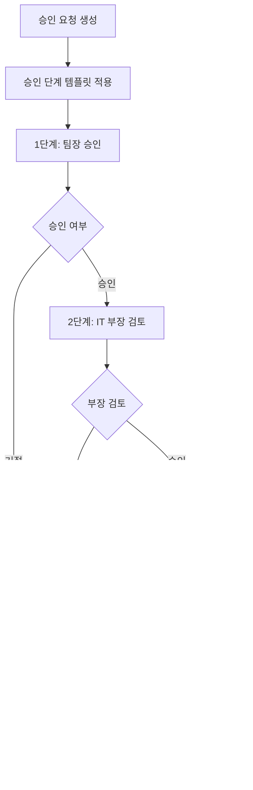

# 📋 승인관리 시스템 (Approval Management System)

## 🎯 개요

LINA Data Portal의 승인관리 시스템은 데이터 접근, 대시보드 배포, 리포트 발행 등 다양한 리소스에 대한 체계적인 승인 워크플로우를 제공합니다.

## 🏗️ 시스템 아키텍처

### 핵심 컴포넌트

```
┌─────────────────┐    ┌─────────────────┐    ┌─────────────────┐
│   Approval      │    │ ApprovalStep    │    │ApprovalStepTemp │
│   (승인 요청)    │────│  (승인 단계)     │────│  (단계 템플릿)   │
└─────────────────┘    └─────────────────┘    └─────────────────┘
         │                       │                       │
         │                       │                       │
┌─────────────────┐    ┌─────────────────┐    ┌─────────────────┐
│      User       │    │  TargetObject   │    │ SecurityPolicy  │
│   (사용자)       │    │  (승인 대상)     │    │   (보안 정책)    │
└─────────────────┘    └─────────────────┘    └─────────────────┘
```

## 📊 데이터 모델

### 1. Approval (승인 요청)

```java
@Entity
public class Approval {
    // 기본 정보
    private Long id;
    private ApprovalType type;          // DASHBOARD_DEPLOY, DATA_ACCESS, REPORT_PUBLISH
    private String title;
    private String description;
    private ApprovalStatus status;      // PENDING, APPROVED, REJECTED
    private Priority priority;          // URGENT, HIGH, MEDIUM, LOW
    
    // 요청자/검토자 정보 (정규화)
    private Long requesterId;
    private String requesterEmail;      // 보조 정보
    private String requesterName;       // 보조 정보
    private Long reviewerId;
    private String reviewerEmail;       // 보조 정보
    private String reviewerName;        // 보조 정보
    
    // 승인 대상 오브젝트 (1급 개념)
    private TargetType targetType;      // DATASET, DASHBOARD, REPORT, CLUSTER 등
    private String targetId;
    private String targetName;
    private AccessScope accessScope;    // READ, WRITE, DEPLOY, SHARE 등
    private SensitivityLevel sensitivityLevel; // NORMAL, SENSITIVE, PII, CONFIDENTIAL
    
    // 사용 기간 관리
    private Integer usageDurationDays = 90;  // 기본 3개월
    private LocalDateTime usageExpiresAt;
    
    // 보안 정책
    private Boolean requiresMasking = false;
    private Boolean requiresAuditLog = false;
    private Long maskingPolicyId;
    private Long policySetId;
    
    // 업무 정당성
    private String businessJustification;
    private String dataUsagePurpose;
    private LocalDateTime expectedCompletionDate;
}
```

### 2. ApprovalStep (승인 단계)

실제 승인 진행을 위한 승인 단계로, ApprovalStepTemplate의 스냅샷입니다.

```java
@Entity
public class ApprovalStep {
    // 기본 정보
    private Long id;
    private Long approvalId;            // 승인 요청 ID
    private Long templateId;            // 기반이 된 템플릿 ID
    private Long templateVersion;       // 템플릿 생성 당시의 버전
    private Integer stepOrder;          // 단계 순서 (1, 2, 3...)
    
    // 승인자 정보 (정규화 - User 참조)
    private Long approverId;            // 승인자 ID (User 테이블 참조)
    private String approverEmail;       // 승인자 이메일 (보조 정보)
    private String approverName;        // 승인자 이름 (보조 정보)
    private String approverRole;        // 승인자 역할 (템플릿에서 복사)
    private String approverDepartment;  // 승인자 부서 (템플릿에서 복사)
    
    // 승인 상태
    private ApprovalStepStatus status;  // PENDING, APPROVED, REJECTED, SKIPPED
    private Boolean isRequired = true;  // 필수 단계 여부
    private String description;         // 단계 설명
    
    // 승인 처리 정보
    private LocalDateTime approvedAt;
    private String approvalComment;
    
    // 동시성 제어
    private Long version;               // 낙관적 잠금
}
```

### 3. ApprovalStepTemplate (승인 단계 템플릿)

승인 타입별 승인 단계를 정의하는 템플릿입니다.

```java
@Entity
public class ApprovalStepTemplate {
    // 기본 정보
    private Long id;
    private ApprovalType approvalType;  // ACCESS, CREATE, DEPLOY, SUBSCRIBE 등
    private Integer stepOrder;          // 단계 순서 (1, 2, 3...)
    
    // 승인자 정보 (역할 기반 또는 특정 사용자)
    private String approverRole;        // "팀장", "부장", "이사"
    private String approverDepartment;  // "데이터분석팀", "IT팀"
    private Long approverId;            // 특정 승인자 지정 시 (선택적)
    private String approverEmail;       // 보조 정보
    private String approverName;        // 보조 정보
    
    // 템플릿 설정
    private Boolean isRequired = true;  // 필수 단계 여부
    private Boolean isActive = true;    // 템플릿 활성 상태
    private String description;         // 단계 설명
    
    // 버전 관리
    private Long version;               // 템플릿 수정 시마다 증가
}
```

**특징:**
- 승인 타입(ApprovalType)별로 여러 단계 정의 가능
- 역할 기반 또는 특정 사용자 지정 가능
- 템플릿 변경 시 기존 진행 중인 승인에는 영향 없음 (스냅샷 방식)

## 🔄 승인 워크플로우

### 1. 승인 요청 생성

```java
// 1. 승인 요청 생성
Approval approval = new Approval(
    ApprovalType.ACCESS,
    "고객 데이터 분석 권한 요청",
    "마케팅 캠페인 효과 분석을 위한 고객 데이터 접근",
    requesterId,
    requesterEmail,
    requesterName
);
approval.setTargetType(TargetType.DATASET);
approval.setTargetId("customer_dataset_001");
approval.setTargetName("고객 행동 데이터셋");
approval.setAccessScope(AccessScope.READ);
approval.setSensitivityLevel(SensitivityLevel.PII);

// 2. 승인 요청 저장
approvalRepository.save(approval);

// 3. 템플릿 기반 승인 단계 생성
List<ApprovalStep> steps = approvalStepService.createApprovalStepsFromTemplate(
    approval.getId(), 
    approval.getType()
);
```

### 2. 승인 단계 처리



**승인 단계 상태 (ApprovalStepStatus):**
- `PENDING`: 승인 대기 중
- `APPROVED`: 승인 완료
- `REJECTED`: 승인 거절
- `SKIPPED`: 단계 건너뜀 (선택적 승인 단계)

### 3. 사용 기간 관리

```java
// 민감도별 차등 사용 기간
if (accessScope.isTemporary()) {
    approval.setUsageDurationDays(1);      // 임시 권한: 1일
} else if (sensitivityLevel.isHighSensitive()) {
    approval.setUsageDurationDays(30);     // 민감정보: 1개월
} else {
    approval.setUsageDurationDays(90);     // 일반: 3개월 (기본값)
}

// 승인 완료 시 사용 권한 활성화
approval.activateUsage();
```

## 🎯 승인 대상 오브젝트 (Target Objects)

### 지원하는 대상 타입

| TargetType | 설명 | 예시 |
|------------|------|------|
| `DATASET` | 데이터셋 | 고객 데이터, 매출 데이터 |
| `DASHBOARD` | 대시보드 | 실시간 모니터링 대시보드 |
| `REPORT` | 리포트 | 월간 성과 리포트 |
| `NOTEBOOK` | 노트북 | Jupyter 노트북 |
| `CLUSTER` | 클러스터 | Databricks 클러스터 |
| `MODEL` | ML 모델 | 고객 이탈 예측 모델 |
| `API` | API 엔드포인트 | 외부 API 연동 |
| `FILE` | 파일 | 데이터 파일, 문서 |

### 접근 범위 (Access Scope)

| AccessScope | 설명 | 권한 레벨 |
|-------------|------|-----------|
| `READ` | 읽기 전용 | 낮음 |
| `WRITE` | 읽기/쓰기 | 중간 |
| `DELETE` | 삭제 권한 | 높음 |
| `DEPLOY` | 배포 권한 | 높음 |
| `SHARE` | 공유 권한 | 중간 |
| `EXPORT` | 내보내기 | 중간 |
| `ADMIN` | 관리자 권한 | 최고 |
| `MASKED_READ` | 마스킹된 읽기 | 낮음 |
| `TEMPORARY_READ` | 임시 읽기 | 낮음 |

### 민감도 레벨 (Sensitivity Level)

| SensitivityLevel | 설명 | 기본 사용기간 | 추가 승인 |
|------------------|------|---------------|-----------|
| `PUBLIC` | 공개 정보 | 90일 | 불필요 |
| `INTERNAL` | 내부 정보 | 90일 | 불필요 |
| `NORMAL` | 일반 정보 | 90일 | 불필요 |
| `SENSITIVE` | 민감 정보 | 30일 | 필요 |
| `CONFIDENTIAL` | 기밀 정보 | 30일 | 필요 |
| `PII` | 개인정보 | 30일 | 필요 |
| `PHI` | 의료정보 | 30일 | 필요 |
| `FINANCIAL` | 금융정보 | 30일 | 필요 |

## 🔐 보안 정책 연동

### 1. 자동 보안 정책 적용

```java
public void applySecurityPolicies(Approval approval) {
    // 민감도 레벨에 따른 기본 정책
    if (approval.getSensitivityLevel().isHighSensitive()) {
        approval.setRequiresMasking(true);
        approval.setRequiresAuditLog(true);
        approval.setUsageDurationDays(30); // 1개월로 제한
    }
    
    // 고위험 접근 범위의 경우 추가 제한
    if (approval.getAccessScope().isHighRisk()) {
        approval.setRequiresAuditLog(true);
        approval.setUsageDurationDays(7); // 1주일로 제한
    }
}
```

### 2. 마스킹 정책 연동

```java
@Entity
public class MaskingPolicy {
    private Long id;
    private String policyName;
    private String targetColumn;
    private MaskingType maskingType;    // FULL, PARTIAL, HASH, ENCRYPT
    private String maskingPattern;      // "***-**-1234"
    private Boolean isActive = true;
}
```

## 📊 API 엔드포인트

### 승인 요청 관리

```http
# 승인 요청 생성
POST /api/approvals
Content-Type: application/json

{
  "type": "DATA_ACCESS",
  "title": "고객 데이터 분석 권한",
  "description": "마케팅 캠페인 분석용",
  "targetType": "DATASET",
  "targetId": "customer_dataset_001",
  "targetName": "고객 행동 데이터셋",
  "accessScope": "READ",
  "sensitivityLevel": "PII",
  "businessJustification": "고객 세그먼트 분석 및 타겟 마케팅 전략 수립",
  "dataUsagePurpose": "개인정보는 마스킹 처리하여 통계 분석 목적으로만 사용",
  "expectedCompletionDate": "2024-03-15T00:00:00"
}
```

```http
# 승인 요청 목록 조회
GET /api/approvals?status=PENDING&type=DATA_ACCESS&page=0&size=20

# 승인 요청 상세 조회
GET /api/approvals/{id}

# 내가 요청한 승인 목록
GET /api/approvals/submitted

# 내가 처리해야 할 승인 목록
GET /api/approvals/pending
```

### 승인 처리

```http
# 승인 처리
PUT /api/approvals/{id}/approve
Content-Type: application/json

{
  "comment": "업무 목적이 명확하고 보안 정책을 준수하여 승인합니다.",
  "conditions": ["마스킹 처리 필수", "30일 후 자동 만료"]
}

# 거절 처리
PUT /api/approvals/{id}/reject
Content-Type: application/json

{
  "comment": "업무 정당성이 불충분합니다. 추가 설명이 필요합니다.",
  "reason": "INSUFFICIENT_JUSTIFICATION"
}
```

### 사용 권한 관리

```http
# 만료 예정 권한 조회 (30일 이내)
GET /api/approvals/expiring?days=30

# 사용 권한 활성화
POST /api/approvals/{id}/activate-usage

# 만료된 권한 정리
POST /api/approvals/cleanup-expired-usage
```

## 🔄 승인 단계 템플릿 시스템

### 1. 템플릿 정의

**ACCESS 타입 템플릿 예시:**

```java
// 1단계: 팀장 승인
ApprovalStepTemplate step1 = new ApprovalStepTemplate(
    ApprovalType.ACCESS, 
    1, 
    "팀장", 
    "데이터분석팀"
);
step1.setDescription("데이터 접근 권한에 대한 팀장 승인");
step1.setIsRequired(true);

// 2단계: IT 부장 승인
ApprovalStepTemplate step2 = new ApprovalStepTemplate(
    ApprovalType.ACCESS, 
    2, 
    "부장", 
    "IT팀"
);
step2.setDescription("데이터 접근 권한에 대한 IT 부장 승인");
step2.setIsRequired(true);

// 3단계: 이사 승인 (선택적)
ApprovalStepTemplate step3 = new ApprovalStepTemplate(
    ApprovalType.ACCESS, 
    3, 
    "이사", 
    "경영지원팀"
);
step3.setDescription("민감 데이터 접근에 대한 최종 승인");
step3.setIsRequired(false);
```

**REST API로 템플릿 생성:**

```http
POST /api/approval-step-templates
Content-Type: application/json

{
  "approvalType": "ACCESS",
  "stepOrder": 1,
  "approverRole": "팀장",
  "approverDepartment": "데이터분석팀",
  "isRequired": true,
  "isActive": true,
  "description": "데이터 접근 권한에 대한 팀장 승인"
}
```

### 2. 동적 승인 단계 생성

```java
@Service
public class ApprovalStepService {
    
    public List<ApprovalStep> createApprovalStepsFromTemplate(Long approvalId, ApprovalType approvalType) {
        // 1. 현재 활성화된 템플릿들 조회
        List<ApprovalStepTemplate> templates = templateRepository
            .findByApprovalTypeAndIsActiveTrueOrderByStepOrder(approvalType);
        
        if (templates.isEmpty()) {
            throw new RuntimeException("No active approval step templates found for type: " + approvalType);
        }
        
        // 2. 템플릿을 기반으로 승인 단계들 생성 (스냅샷)
        List<ApprovalStep> steps = templates.stream()
            .map(template -> ApprovalStep.fromTemplate(approvalId, template))
            .toList();
        
        // 3. 승인 단계 저장
        return approvalStepRepository.saveAll(steps);
    }
}
```

**템플릿 기반 생성 메서드:**

```java
public class ApprovalStep {
    /**
     * 템플릿으로부터 승인 단계 생성 (스냅샷)
     */
    public static ApprovalStep fromTemplate(Long approvalId, ApprovalStepTemplate template) {
        ApprovalStep step = new ApprovalStep();
        step.approvalId = approvalId;
        step.templateId = template.getId();
        step.templateVersion = template.getVersion();
        step.stepOrder = template.getStepOrder();
        step.approverRole = template.getApproverRole();
        step.approverDepartment = template.getApproverDepartment();
        step.isRequired = template.getIsRequired();
        step.description = template.getDescription();
        return step;
    }
    
    /**
     * 템플릿으로부터 승인 단계 생성 (실제 승인자 지정)
     */
    public static ApprovalStep fromTemplate(Long approvalId, ApprovalStepTemplate template, User actualApprover) {
        ApprovalStep step = fromTemplate(approvalId, template);
        step.approverId = actualApprover.getId();
        step.approverEmail = actualApprover.getEmail();
        step.approverName = actualApprover.getName();
        return step;
    }
}
```

## 📈 모니터링 & 분석

### 1. 승인 현황 대시보드

```java
@RestController
public class ApprovalAnalyticsController {
    
    // 승인 현황 통계
    @GetMapping("/api/approvals/analytics/status")
    public ApprovalStatusStats getApprovalStatusStats() {
        return ApprovalStatusStats.builder()
            .totalPending(approvalService.countByStatus(PENDING))
            .totalApproved(approvalService.countByStatus(APPROVED))
            .totalRejected(approvalService.countByStatus(REJECTED))
            .avgProcessingTime(approvalService.getAverageProcessingTime())
            .build();
    }
    
    // 민감도별 승인 분포
    @GetMapping("/api/approvals/analytics/sensitivity")
    public List<SensitivityDistribution> getSensitivityDistribution() {
        return approvalService.getApprovalsBySensitivityLevel();
    }
}
```

### 2. 성능 지표

| 지표 | 설명 | 목표 |
|------|------|------|
| 평균 처리 시간 | 요청부터 최종 승인까지 | < 3일 |
| 승인율 | 전체 요청 대비 승인 비율 | > 85% |
| SLA 준수율 | 기한 내 처리 비율 | > 95% |
| 자동화율 | 자동 정책 적용 비율 | > 70% |

## 🚀 향후 개발 계획

### Phase 1 - 고급 워크플로우
- [ ] 조건부 승인 (임시 승인, 조건부 승인)
- [ ] 병렬 승인 처리 (여러 승인자 동시 검토)
- [ ] 승인 위임 및 대리 승인
- [ ] 긴급 승인 프로세스

### Phase 2 - 지능형 자동화
- [ ] AI 기반 승인 추천 시스템
- [ ] 위험도 자동 평가 모델
- [ ] 승인 패턴 학습 및 최적화
- [ ] 자동 만료 알림 시스템

### Phase 3 - 고급 보안 기능
- [ ] 동적 마스킹 정책 적용
- [ ] 실시간 접근 모니터링
- [ ] 이상 행위 탐지 및 알림
- [ ] 블록체인 기반 감사 로그

---

**문서 버전**: v2.0  
**최종 업데이트**: 2024년 1월 20일  
**담당자**: Backend Development Team


## 💡 실제 승인 플로우 예시

### 시나리오: 개인정보 포함 고객 데이터 접근 권한 요청

**배경:**
- 마케팅팀 김분석 사원이 고객 세그먼트 분석을 위해 개인정보가 포함된 고객 데이터셋 접근 권한을 요청합니다.
- 해당 데이터셋은 민감도 레벨이 PII(개인정보)로 분류되어 있습니다.

---

### Step 1: 승인 요청 생성 (김분석 사원)

**API 호출:**
```http
POST /api/approvals
Content-Type: application/json
Authorization: Bearer {김분석_토큰}

{
  "type": "ACCESS",
  "title": "고객 세그먼트 분석을 위한 데이터 접근 권한",
  "description": "Q4 마케팅 캠페인 효과 분석을 위한 고객 행동 데이터 접근",
  "targetType": "DATASET",
  "targetId": "customer_behavior_2024",
  "targetName": "고객 행동 데이터셋 2024",
  "accessScope": "READ",
  "sensitivityLevel": "PII",
  "businessJustification": "고객 세그먼트별 구매 패턴 분석 및 타겟 마케팅 전략 수립",
  "dataUsagePurpose": "개인정보는 마스킹 처리하여 통계 분석 목적으로만 사용",
  "expectedCompletionDate": "2024-03-31T23:59:59",
  "usageDurationDays": 30
}
```

**응답:**
```json
{
  "id": 101,
  "type": "ACCESS",
  "status": "PENDING",
  "title": "고객 세그먼트 분석을 위한 데이터 접근 권한",
  "requesterId": 5,
  "requesterName": "김분석",
  "requesterEmail": "kim.analyst@company.com",
  "targetType": "DATASET",
  "targetId": "customer_behavior_2024",
  "sensitivityLevel": "PII",
  "currentStep": 1,
  "totalSteps": 3,
  "createdAt": "2024-01-15T09:00:00"
}
```

---

### Step 2: 승인 단계 자동 생성

시스템이 ACCESS 타입의 템플릿을 기반으로 승인 단계를 자동 생성합니다.

**생성된 승인 단계:**

| 단계 | 승인자 | 역할 | 부서 | 상태 | 필수 여부 |
|------|--------|------|------|------|-----------|
| 1 | 이팀장 | 팀장 | 마케팅팀 | PENDING | 필수 |
| 2 | 박부장 | 부장 | IT팀 | PENDING | 필수 |
| 3 | 최이사 | 이사 | 경영지원팀 | PENDING | 선택 |

**데이터베이스 상태:**
```sql
-- approvals 테이블
INSERT INTO approvals (id, type, status, title, requester_id, target_type, target_id, sensitivity_level)
VALUES (101, 'ACCESS', 'PENDING', '고객 세그먼트 분석을 위한 데이터 접근 권한', 5, 'DATASET', 'customer_behavior_2024', 'PII');

-- approval_steps 테이블
INSERT INTO approval_steps (approval_id, template_id, step_order, approver_id, approver_name, status, is_required)
VALUES 
  (101, 1, 1, 10, '이팀장', 'PENDING', true),
  (101, 2, 2, 20, '박부장', 'PENDING', true),
  (101, 3, 3, 30, '최이사', 'PENDING', false);
```

---

### Step 3: 1단계 승인 (이팀장)

**이팀장이 대기 중인 승인 목록 조회:**
```http
GET /api/approvals/pending
Authorization: Bearer {이팀장_토큰}
```

**응답:**
```json
{
  "content": [
    {
      "id": 101,
      "title": "고객 세그먼트 분석을 위한 데이터 접근 권한",
      "requesterName": "김분석",
      "targetType": "DATASET",
      "targetName": "고객 행동 데이터셋 2024",
      "sensitivityLevel": "PII",
      "currentStep": 1,
      "myStepOrder": 1,
      "createdAt": "2024-01-15T09:00:00"
    }
  ]
}
```

**이팀장이 승인 처리:**
```http
PUT /api/approvals/101/steps/1/approve
Content-Type: application/json
Authorization: Bearer {이팀장_토큰}

{
  "comment": "업무 목적이 명확하고 데이터 사용 계획이 적절합니다. 승인합니다."
}
```

**응답:**
```json
{
  "stepId": 1,
  "approvalId": 101,
  "stepOrder": 1,
  "status": "APPROVED",
  "approverName": "이팀장",
  "approvedAt": "2024-01-15T10:30:00",
  "comment": "업무 목적이 명확하고 데이터 사용 계획이 적절합니다. 승인합니다.",
  "nextStep": {
    "stepOrder": 2,
    "approverName": "박부장",
    "approverDepartment": "IT팀"
  }
}
```

---

### Step 4: 2단계 승인 (박부장)

**박부장이 승인 처리:**
```http
PUT /api/approvals/101/steps/2/approve
Content-Type: application/json
Authorization: Bearer {박부장_토큰}

{
  "comment": "보안 정책을 준수하며, 마스킹 처리 조건으로 승인합니다."
}
```

**응답:**
```json
{
  "stepId": 2,
  "approvalId": 101,
  "stepOrder": 2,
  "status": "APPROVED",
  "approverName": "박부장",
  "approvedAt": "2024-01-15T14:20:00",
  "comment": "보안 정책을 준수하며, 마스킹 처리 조건으로 승인합니다.",
  "nextStep": {
    "stepOrder": 3,
    "approverName": "최이사",
    "approverDepartment": "경영지원팀",
    "isRequired": false
  }
}
```

---

### Step 5: 3단계 건너뛰기 (선택적 단계)

**최이사가 선택적 단계를 건너뛰기:**
```http
PUT /api/approvals/101/steps/3/skip
Content-Type: application/json
Authorization: Bearer {최이사_토큰}

{
  "comment": "이전 단계에서 충분히 검토되었으므로 건너뜁니다."
}
```

**또는 시스템이 자동으로 건너뛰기 (선택적 단계이고 필수 단계가 모두 승인된 경우):**

---

### Step 6: 최종 승인 완료 및 권한 활성화

**승인 상태 자동 업데이트:**
```sql
-- 모든 필수 단계가 승인되었으므로 승인 요청 상태를 APPROVED로 변경
UPDATE approvals 
SET status = 'APPROVED', 
    approved_at = '2024-01-15T14:25:00',
    usage_expires_at = '2024-02-14T23:59:59'  -- 30일 후
WHERE id = 101;
```

**권한 활성화 API 호출 (자동 또는 수동):**
```http
POST /api/approvals/101/activate-usage
Authorization: Bearer {시스템_관리자_토큰}
```

**응답:**
```json
{
  "approvalId": 101,
  "status": "APPROVED",
  "usageActivated": true,
  "usageExpiresAt": "2024-02-14T23:59:59",
  "accessToken": "eyJhbGciOiJIUzI1NiIsInR5cCI6IkpXVCJ9...",
  "permissions": {
    "targetType": "DATASET",
    "targetId": "customer_behavior_2024",
    "accessScope": "READ",
    "maskingRequired": true,
    "auditLogRequired": true
  }
}
```

---

### Step 7: 실제 데이터 접근 (김분석 사원)

**데이터 조회 API 호출:**
```http
GET /api/datasets/customer_behavior_2024/query
Content-Type: application/json
Authorization: Bearer {김분석_토큰}
X-Approval-Token: eyJhbGciOiJIUzI1NiIsInR5cCI6IkpXVCJ9...

{
  "query": "SELECT customer_segment, COUNT(*) as count, AVG(purchase_amount) as avg_amount FROM customer_behavior_2024 GROUP BY customer_segment",
  "limit": 1000
}
```

**시스템 검증:**
1. ✅ 승인 토큰 유효성 확인
2. ✅ 만료 시간 확인 (2024-02-14까지 유효)
3. ✅ 접근 범위 확인 (READ 권한)
4. ✅ 마스킹 정책 적용 (개인정보 필드 자동 마스킹)
5. ✅ 감사 로그 기록

**응답 (마스킹 처리된 데이터):**
```json
{
  "data": [
    {
      "customer_segment": "VIP",
      "count": 1250,
      "avg_amount": 450000
    },
    {
      "customer_segment": "일반",
      "count": 8500,
      "avg_amount": 120000
    }
  ],
  "metadata": {
    "approvalId": 101,
    "maskingApplied": true,
    "maskedFields": ["customer_name", "phone_number", "email"],
    "accessedAt": "2024-01-15T15:00:00",
    "expiresAt": "2024-02-14T23:59:59"
  }
}
```

---

### Step 8: 만료 및 권한 회수

**30일 후 자동 만료:**
```sql
-- 스케줄러가 매일 실행하여 만료된 권한 정리
UPDATE approvals 
SET status = 'EXPIRED'
WHERE usage_expires_at < NOW() 
  AND status = 'APPROVED';
```

**만료 알림 (7일 전):**
```http
POST /api/notifications/send
Content-Type: application/json

{
  "userId": 5,
  "type": "APPROVAL_EXPIRING",
  "title": "데이터 접근 권한 만료 예정",
  "message": "고객 행동 데이터셋 2024 접근 권한이 7일 후 만료됩니다. 계속 사용이 필요한 경우 재신청해주세요.",
  "approvalId": 101,
  "expiresAt": "2024-02-14T23:59:59"
}
```

**만료 후 접근 시도:**
```http
GET /api/datasets/customer_behavior_2024/query
Authorization: Bearer {김분석_토큰}
X-Approval-Token: eyJhbGciOiJIUzI1NiIsInR5cCI6IkpXVCJ9...
```

**응답 (403 Forbidden):**
```json
{
  "error": "APPROVAL_EXPIRED",
  "message": "데이터 접근 권한이 만료되었습니다. 재신청이 필요합니다.",
  "approvalId": 101,
  "expiredAt": "2024-02-14T23:59:59",
  "reapplyUrl": "/approvals/reapply/101"
}
```

---

## 📊 승인 프로세스 타임라인

```
09:00 ─┬─ 김분석: 승인 요청 생성
       │   └─ 시스템: 승인 단계 자동 생성 (3단계)
       │
10:30 ─┼─ 이팀장: 1단계 승인 완료
       │   └─ 시스템: 박부장에게 알림 발송
       │
14:20 ─┼─ 박부장: 2단계 승인 완료
       │   └─ 시스템: 최이사에게 알림 발송
       │
14:25 ─┼─ 시스템: 필수 단계 모두 승인 → 최종 승인
       │   └─ 시스템: 권한 활성화 및 김분석에게 알림
       │
15:00 ─┼─ 김분석: 데이터 접근 시작
       │   └─ 시스템: 마스킹 적용 + 감사 로그 기록
       │
       │   ... 30일간 사용 ...
       │
02/07 ─┼─ 시스템: 만료 7일 전 알림 발송
       │
02/14 ─┴─ 시스템: 권한 자동 만료 및 회수
```

---

## 🔍 주요 특징

### 1. 자동화된 워크플로우
- 승인 타입에 따른 자동 단계 생성
- 단계별 자동 알림 발송
- 만료 시간 자동 관리

### 2. 보안 정책 자동 적용
- 민감도 레벨에 따른 마스킹 정책
- 접근 범위 제한
- 감사 로그 자동 기록

### 3. 유연한 승인 구조
- 필수/선택 단계 구분
- 단계 건너뛰기 지원
- 병렬 승인 지원 (향후)

### 4. 권한 생명주기 관리
- 사용 기간 설정
- 만료 알림
- 자동 권한 회수

---

**문서 버전**: v2.1  
**최종 업데이트**: 2024년 1월 20일  
**담당자**: Backend Development Team
