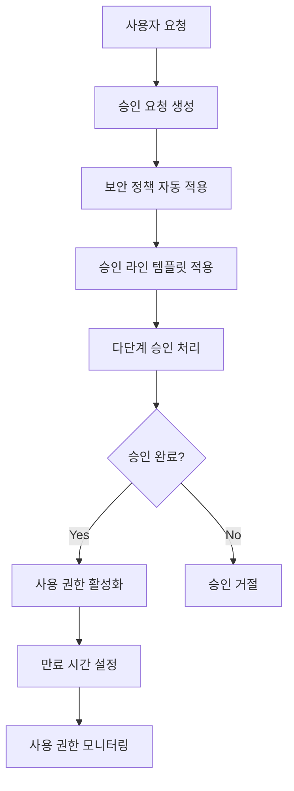
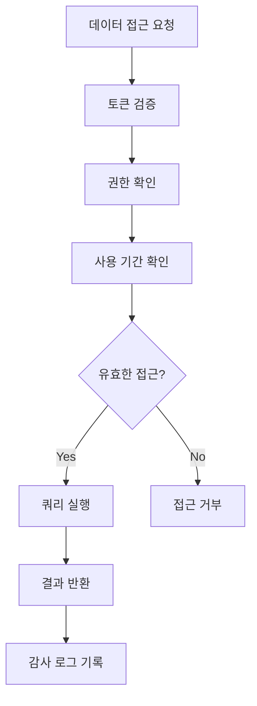
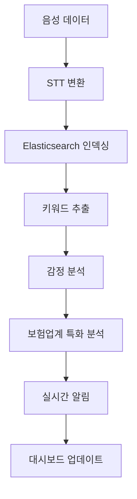

# 🏢 LINA Data Portal 시스템 개요 (System Overview)

## 🎯 프로젝트 비전

LINA Data Portal은 보험업계 특화 데이터 분석 플랫폼으로, 데이터 민주화와 거버넌스의 균형을 통해 조직의 데이터 기반 의사결정을 지원합니다.

## 🏗️ 전체 시스템 아키텍처

```
┌─────────────────────────────────────────────────────────────────────────────┐
│                           LINA Data Portal Frontend                         │
│  ┌─────────────┐  ┌─────────────┐  ┌─────────────┐  ┌─────────────────────┐ │
│  │ Dashboard   │  │ Data Catalog│  │ STT Search  │  │   Approval          │ │
│  │ Store       │  │ Explorer    │  │ Analytics   │  │   Management        │ │
│  └─────────────┘  └─────────────┘  └─────────────┘  └─────────────────────┘ │
└─────────────────────────────────────────────────────────────────────────────┘
                                      │
                                      ▼
┌─────────────────────────────────────────────────────────────────────────────┐
│                        LINA Data Portal Backend API                        │
│                                                                             │
│  ┌─────────────────┐    ┌─────────────────┐    ┌─────────────────────────┐ │
│  │   Dashboard     │    │   Approval      │    │    Data Catalog         │ │
│  │   Management    │    │   Workflow      │    │    Management           │ │
│  └─────────────────┘    └─────────────────┘    └─────────────────────────┘ │
│                                                                             │
│  ┌─────────────────┐    ┌─────────────────┐    ┌─────────────────────────┐ │
│  │   STT Search    │    │   Query Engine  │    │    Security &           │ │
│  │   & Analytics   │    │   (Databricks)  │    │    Token Management     │ │
│  └─────────────────┘    └─────────────────┘    └─────────────────────────┘ │
└─────────────────────────────────────────────────────────────────────────────┘
                                      │
                                      ▼
┌─────────────────────────────────────────────────────────────────────────────┐
│                            Data & Infrastructure Layer                      │
│                                                                             │
│  ┌─────────────────┐    ┌─────────────────┐    ┌─────────────────────────┐ │
│  │   PostgreSQL    │    │  Elasticsearch  │    │      Databricks         │ │
│  │   (Metadata)    │    │  (STT Search)   │    │   (Data Processing)     │ │
│  └─────────────────┘    └─────────────────┘    └─────────────────────────┘ │
│                                                                             │
│  ┌─────────────────┐    ┌─────────────────┐    ┌─────────────────────────┐ │
│  │   File Storage  │    │   External APIs │    │    Monitoring &         │ │
│  │   (Reports)     │    │   (OpenAI, etc) │    │    Logging              │ │
│  └─────────────────┘    └─────────────────┘    └─────────────────────────┘ │
└─────────────────────────────────────────────────────────────────────────────┘
```

## 🎯 핵심 기능 영역

### 1. 🏪 Dashboard Store & Management
**목적**: 대시보드 템플릿 관리 및 배포
- 대시보드 템플릿 카탈로그
- 설치 및 구독 관리
- 평점 및 리뷰 시스템
- 개인화된 대시보드 관리

### 2. ✅ Approval Management System
**목적**: 체계적인 승인 워크플로우 및 거버넌스
- 다단계 승인 워크플로우
- 승인 대상 오브젝트 관리 (데이터셋, 대시보드, 리포트 등)
- 사용 기간 관리 (기본 3개월, 민감도별 차등)
- 보안 정책 자동 적용

### 3. 📚 Data Catalog System
**목적**: 데이터 자산 발견성 및 메타데이터 관리
- 통합 데이터 카탈로그
- 데이터 품질 모니터링
- 데이터 계보 추적
- 비즈니스 용어집 관리

### 4. 🎙️ STT Search & Analytics
**목적**: 음성 인식 데이터 분석 및 인사이트
- Elasticsearch 기반 키워드 검색
- 보험업계 특화 분석
- 실시간 품질 모니터링
- 감정 분석 및 트렌드

### 5. 🧱 Databricks Integration
**목적**: 안전한 데이터 쿼리 및 분석 환경
- 암호화된 토큰 관리
- SQL 쿼리 실행 엔진
- Text-to-SQL 자연어 변환
- 쿼리 히스토리 및 성능 모니터링

### 6. 🔐 Security & Governance
**목적**: 데이터 보안 및 규정 준수
- 사용자 기반 접근 제어
- 마스킹 정책 관리
- 감사 로그 및 추적
- 규정 준수 모니터링

## 📊 데이터 플로우

### 1. 승인 요청 플로우


### 2. 데이터 접근 플로우


### 3. STT 분석 플로우


## 🔧 기술 스택 상세

### Backend Framework
- **Spring Boot 3.2.0**: 메인 애플리케이션 프레임워크
- **Spring Security**: 인증/인가 및 보안
- **Spring Data JPA**: 데이터 접근 계층
- **Spring Boot Actuator**: 모니터링 및 헬스체크

### Database & Storage
- **PostgreSQL**: 메인 데이터베이스 (메타데이터, 사용자 정보)
- **H2**: 개발 환경 인메모리 데이터베이스
- **Elasticsearch**: STT 데이터 검색 및 분석
- **File System**: 리포트 파일 저장

### External Integrations
- **Databricks REST API**: 쿼리 실행 및 클러스터 관리
- **OpenAI API**: Text-to-SQL 자연어 처리
- **Elasticsearch**: 고성능 검색 및 분석

### Security & Encryption
- **AES-256-GCM**: 토큰 암호화
- **SHA-256**: 토큰 해시 및 검증
- **JWT**: API 인증 (향후 구현)
- **HTTPS**: 전송 계층 보안

## 📈 성능 및 확장성

### 현재 성능 지표
| 구분 | 지표 | 목표값 |
|------|------|--------|
| API 응답시간 | 평균 응답시간 | < 200ms |
| 쿼리 실행 | Databricks 쿼리 | < 30s |
| 검색 성능 | Elasticsearch 검색 | < 100ms |
| 승인 처리 | 평균 승인 시간 | < 3일 |

### 확장성 고려사항
- **수평 확장**: 마이크로서비스 아키텍처 준비
- **캐싱**: Redis 도입 계획
- **로드 밸런싱**: 다중 인스턴스 지원
- **데이터베이스 샤딩**: 대용량 데이터 처리

## 🔒 보안 아키텍처

### 다층 보안 모델
```
┌─────────────────────────────────────────────────────────────┐
│                    Application Layer                        │
│  • Input Validation  • SQL Injection Prevention            │
│  • XSS Protection   • CSRF Protection                      │
└─────────────────────────────────────────────────────────────┘
                              │
┌─────────────────────────────────────────────────────────────┐
│                   Authentication Layer                      │
│  • User Authentication  • Token Management                 │
│  • Session Management   • Multi-Factor Auth (Future)       │
└─────────────────────────────────────────────────────────────┘
                              │
┌─────────────────────────────────────────────────────────────┐
│                   Authorization Layer                       │
│  • Role-Based Access    • Resource-Level Permissions       │
│  • Approval Workflows   • Usage Duration Control           │
└─────────────────────────────────────────────────────────────┘
                              │
┌─────────────────────────────────────────────────────────────┐
│                      Data Layer                             │
│  • Encryption at Rest   • Encryption in Transit            │
│  • Data Masking        • Audit Logging                     │
└─────────────────────────────────────────────────────────────┘
```

### 보안 정책
- **최소 권한 원칙**: 필요한 최소한의 권한만 부여
- **정기적 권한 검토**: 사용 기간 만료 및 자동 정리
- **감사 추적**: 모든 데이터 접근 기록
- **암호화**: 민감한 토큰 및 데이터 암호화

## 📊 모니터링 & 관찰성

### 현재 모니터링 요소
- **애플리케이션 헬스**: Spring Boot Actuator
- **API 성능**: 응답시간 및 처리량 모니터링
- **데이터베이스 성능**: 쿼리 실행 시간 추적
- **보안 이벤트**: 접근 실패 및 이상 행위 탐지

### 향후 모니터링 계획
- **ELK Stack**: 중앙화된 로깅 및 분석
- **Prometheus + Grafana**: 메트릭 수집 및 시각화
- **APM**: 애플리케이션 성능 모니터링
- **알림 시스템**: 실시간 이상 상황 알림

## 🚀 배포 및 운영

### 현재 배포 환경
- **개발 환경**: H2 인메모리 데이터베이스
- **프로덕션 환경**: PostgreSQL + Elasticsearch
- **빌드 도구**: Maven
- **패키징**: Spring Boot JAR

### 향후 배포 계획
- **컨테이너화**: Docker 기반 배포
- **오케스트레이션**: Kubernetes 도입
- **CI/CD**: GitHub Actions 또는 Jenkins
- **무중단 배포**: Blue-Green 또는 Rolling 배포

## 📋 품질 관리

### 코드 품질
- **정적 분석**: SonarQube 도입 계획
- **테스트 커버리지**: 80% 이상 목표
- **코드 리뷰**: Pull Request 기반 리뷰
- **문서화**: API 문서 자동 생성

### 데이터 품질
- **자동 검증**: 데이터 품질 규칙 엔진
- **모니터링**: 실시간 품질 지표 추적
- **알림**: 품질 저하 시 자동 알림
- **개선**: 품질 개선 제안 시스템

## 🔄 개발 프로세스

### 개발 방법론
- **애자일**: 스프린트 기반 개발
- **DevOps**: 개발과 운영의 통합
- **마이크로서비스**: 점진적 분리 계획
- **API First**: API 우선 설계

### 버전 관리
- **Semantic Versioning**: 의미있는 버전 관리
- **Feature Branch**: 기능별 브랜치 전략
- **Release Branch**: 릴리스 준비 브랜치
- **Hotfix**: 긴급 수정 프로세스

## 📈 비즈니스 가치

### 정량적 효과
- **승인 처리 시간**: 50% 단축 (수동 → 자동화)
- **데이터 발견성**: 300% 향상 (카탈로그 도입)
- **보안 준수율**: 95% 이상 (자동 정책 적용)
- **개발 생산성**: 40% 향상 (재사용 가능한 대시보드)

### 정성적 효과
- **데이터 민주화**: 비개발자도 쉬운 데이터 접근
- **거버넌스 강화**: 체계적인 데이터 관리
- **의사결정 지원**: 실시간 인사이트 제공
- **규정 준수**: 자동화된 보안 정책 적용

## 🎯 로드맵

### 2024 Q1 ✅
- ✅ 기본 승인 워크플로우 구현
- ✅ 데이터 카탈로그 기본 기능
- ✅ STT 검색 시스템 구축
- ✅ Databricks 통합 완료

### 2024 Q2
- [ ] 고급 승인 기능 (조건부, 병렬 승인)
- [ ] 데이터 품질 모니터링 고도화
- [ ] AI 기반 Text-to-SQL 개선
- [ ] 실시간 알림 시스템

### 2024 Q3
- [ ] 마이크로서비스 아키텍처 전환
- [ ] 고급 보안 기능 (MFA, SSO)
- [ ] 성능 최적화 및 캐싱
- [ ] 모바일 앱 지원

### 2024 Q4
- [ ] AI/ML 기반 추천 시스템
- [ ] 고급 분석 및 예측 기능
- [ ] 클라우드 네이티브 전환
- [ ] 글로벌 확장 준비

---

**문서 버전**: v1.0  
**최종 업데이트**: 2024년 1월 20일  
**담당자**: Architecture Team